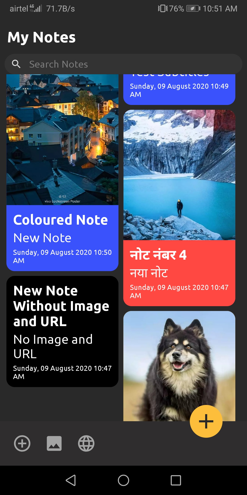
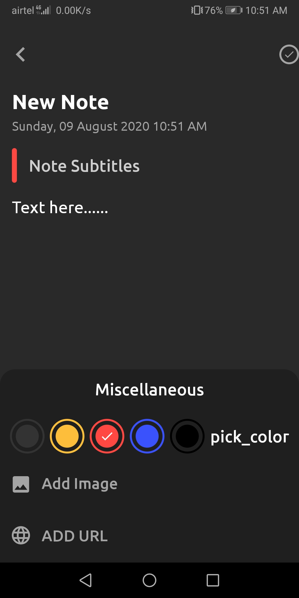

# Description

App Name - **_NoteBook_**

A Handy Application using which you can save 
your Notes, Images and Urls.
Data is store in local database(ROOM)

# Features

1. Save Notes
2. Display Notes in Recycler View
3. Edit your note
4. Add Image, Urls to your Note
5. Delete Note

# What did i learned?

1. Using Room Persistence Library
2. Using Staggered Grid Recycler View

# Screenshots

# Dependencies Used

1. [Room](https://developer.android.com/topic/libraries/architecture/room?gclid=Cj0KCQjwvvj5BRDkARIsAGD9vlKZbOcVl9bNRNwu77mokBInoo6D4hNA3yA5YSBOWw4f-P1P_zwvgNoaAszKEALw_wcB&gclsrc=aw.ds) Persistance Library
2. [Round Image View](https://github.com/vinc3m1/RoundedImageView)
